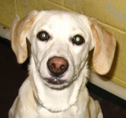
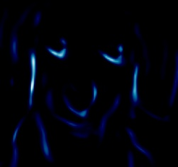
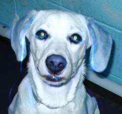

# GradCAMs-ExplainableAI

Learning the basics of explainable AI.

## GradCAMs:

Gradient weighted Class Activation Mapping (Grad-CAM) uses gradients of a particular target that flows through the convolutional network to localize and highlight regions of the target in the image.

## Explaination:

When creating the CNN based classifier please not the layer where the last CNN is located (i.e. this should still be within the feature extraction segment of our Network). Once completed break the sequential network into two parts, Feature Extraction and Classifier. Now, train the network by sequentially combine the two. Once completed add a hook to the feautres segment, so as to extract the gradients of these activations.

```python
# hook for the gradients of the activations
def activations_hook(self, grad):
	self.gradients = grad

def forward(self, x):
		x = self.features_conv(x)
		# register the hook
		h = x.register_hook(self.activations_hook)
		# apply the remaining pooling
		x = self.max_pool(x)
		x = x.view((1, -1))
		x = self.classifier(x)
		return x
```

A CNN based classifier, ends with Dense Layers, at this point we find the highest/most probable class of the image from a trained classifier. This is read and the class prediction value is backpropogated (in VGG this is done on the Linear layer itself). Now an important thing to note here is that we will extract the activation gradients from the last CNN layer here. Thereby, allowing us to get a dimension of (1, number_of_activations, dims_activation[1], dims_activation[0]). Now, here we will take the average across the number_of_activations, thereby, returning (number_of_activations) tensor. These are the pooled gradients.

Now we extract the activations themselves from the segmented network. These are then all multiplied by the pooled gradients, i.e.

```python
for i in range(number_of_activations):
	activations[:, i, :, :] *= pooled_gradients[i]
```

Now, again we take a mean across the number_of_activations dimension of the above activation tensor. This allows us to get a tensor of (1, dims_activation[1], dims_activation[0]), which is then normalized to become the heatmap.

### Original Name:



### Heatmap:



### Super-Imposed Image:

